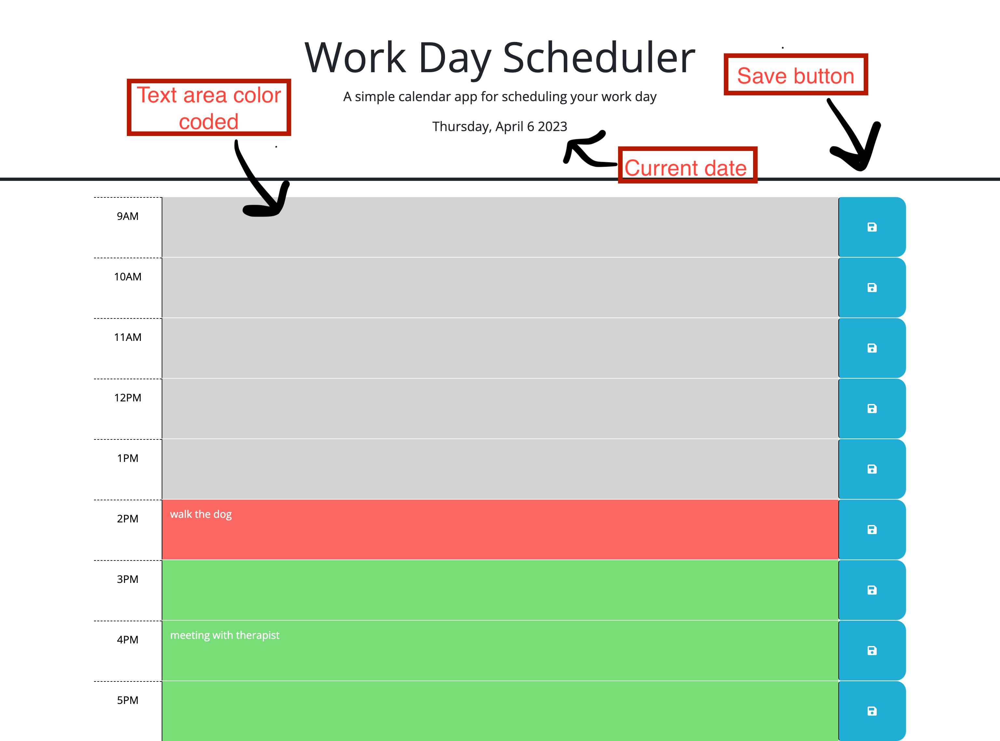

# Work-Day-Scheduler
```
    This webpage will help you create a daily schedule/planner. 
    You will see the current date at the top of the page.
    You will see time blocks for standard business hours. 
    Each time block will be color coded depending on the time of day.
    The current time will be red-pink, the past will be gray and the future will be green. 
    Once you click in the time block you will be able to type the event you want to save for that time block 
    and you will click the save button to the right of your text entry. 
    The event text will be saved to you local storage so you will be able 
    to see it even after refreshing the page.

```





For this project, I looked through all the material we reviewed in class and read from other sources like:
 w3schools.com and developer.mozilla.org/ 

 Links for repository : https://github.com/caroHagg/Work-Day-Scheduler
 Link for live website : https://carohagg.github.io/Work-Day-Scheduler/

 